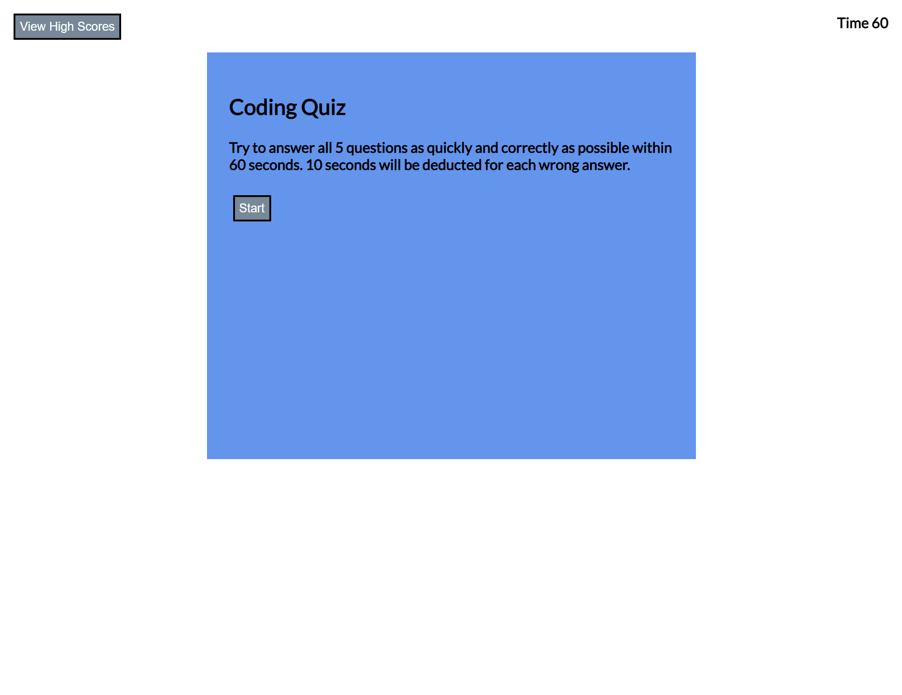
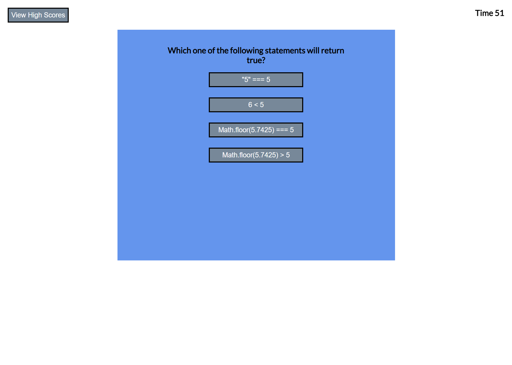
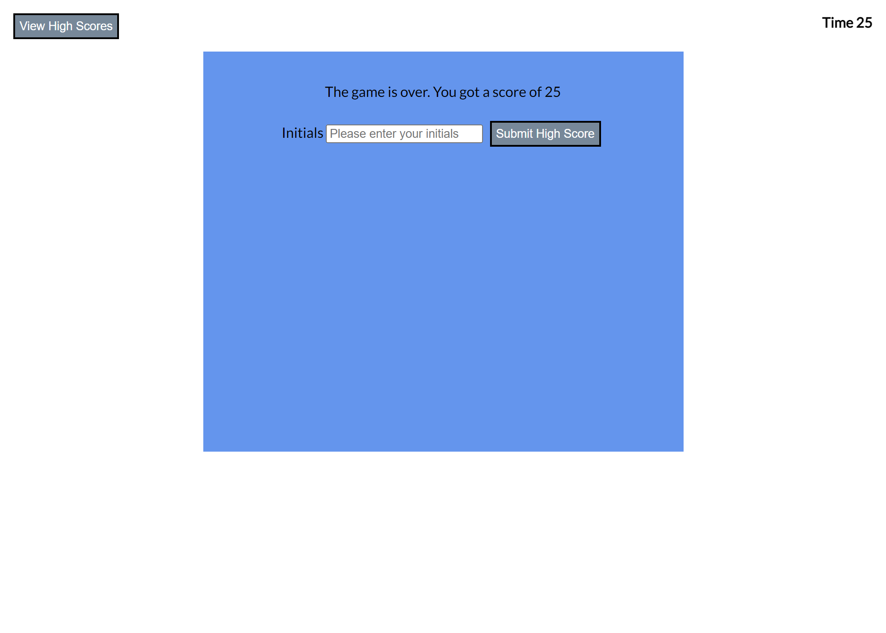
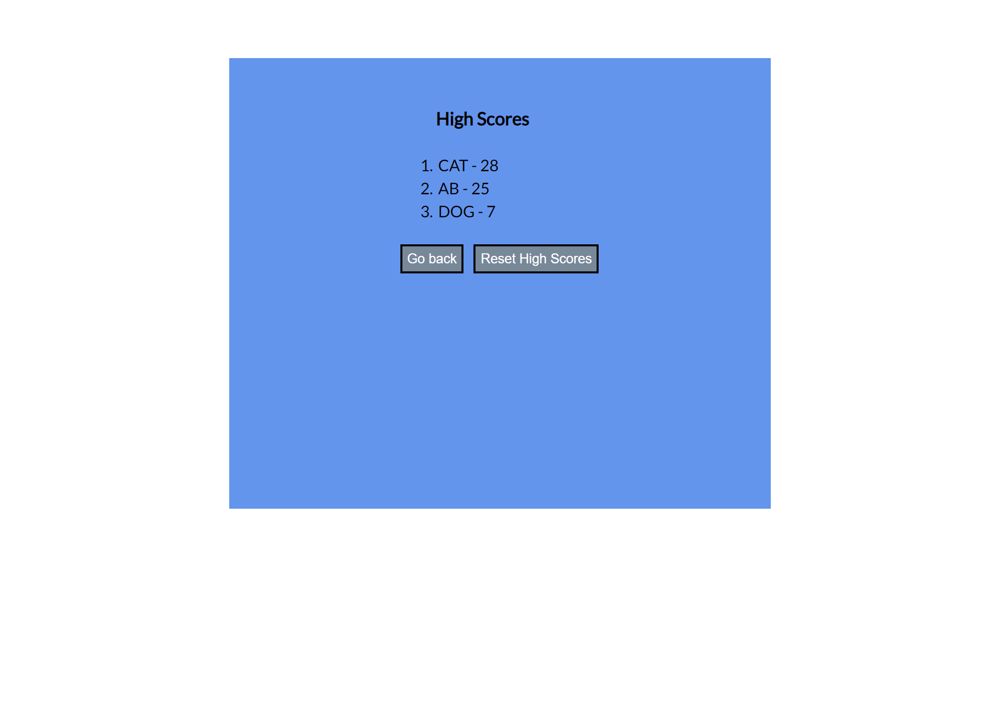

# code-quiz

The contents of this repository are a Code Quiz application. The opening screen explains the quiz and has a start button that will begin the quiz. 5 questions will then be presented in random order. Each question has 4 potential answers, with 1 correct answer. After a question is answered, a message will state whether it was right or not. Wrong answers decrement the time left by 10 seconds. Once time is up or all questions are answered, a game end screen will appear that gives the player's score and let's them submit their score with initials (2 to 3 characters). The score is then added to a high score list that is sorted in descending order. The high scores page has 2 buttons that navigate back to the start page and clear the high scores list respectively. The high score page can be reached at any time via a button in the top left of the page.

The deployed website can be found at: [alextheordinary.github.io/code-quiz/](https://https://alextheordinary.github.io/code-quiz/)

These are screenshots of the completed application:

